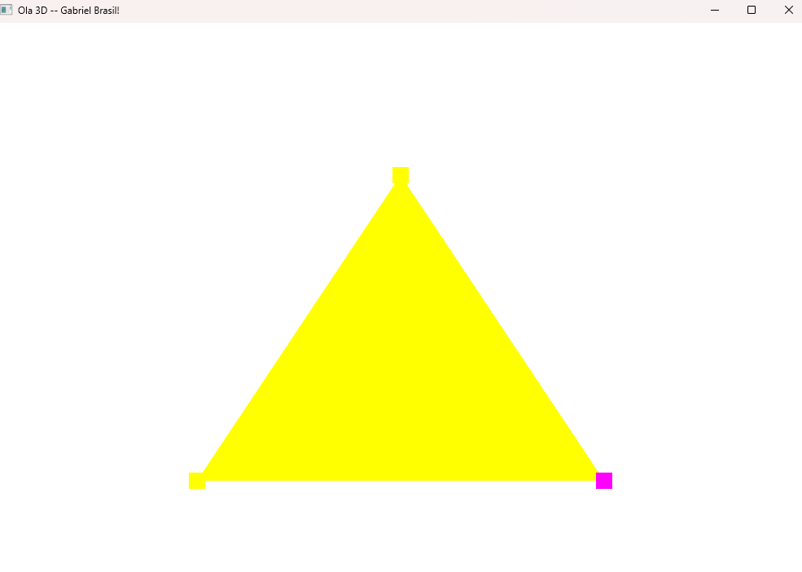
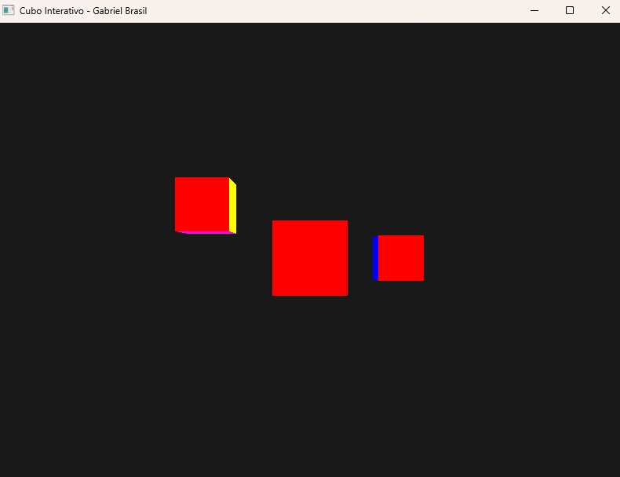
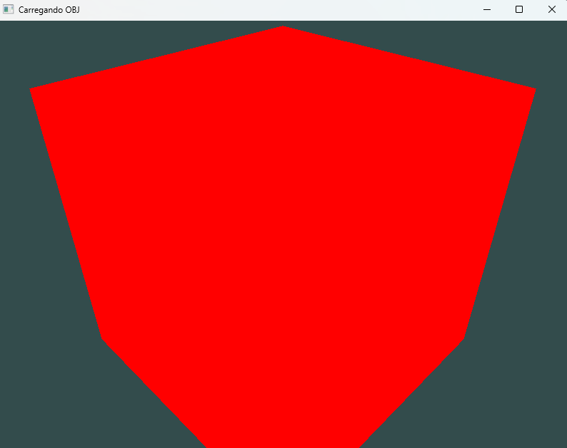
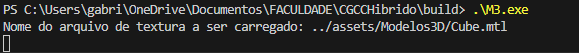
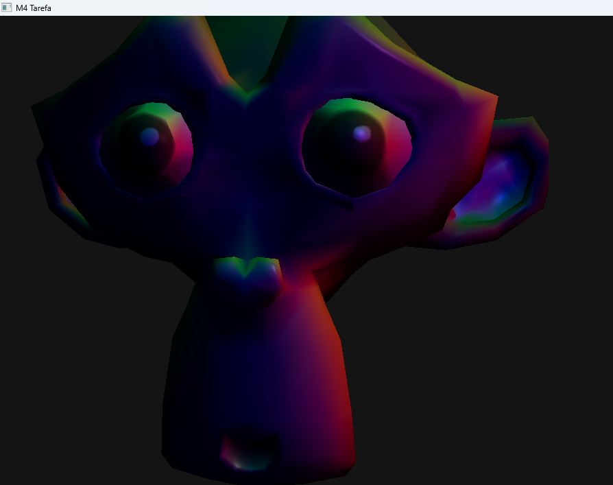
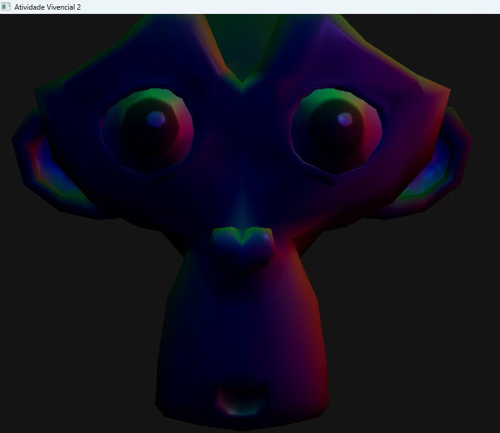
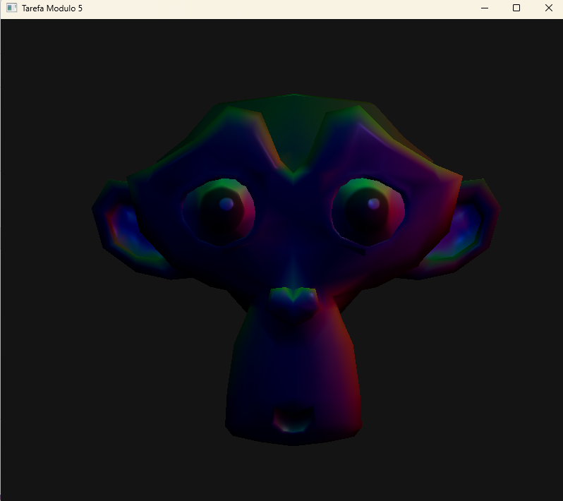

Hello3d:

M2:

M3:

+ Evidência de arquivo .mtl encontrado:

M4: (Modelo está girando, então representação em print mostra apenas momento estático)

Atividade Vivencial 2: (1: Controla luz principal - key light; 2: Controla luz de preenchimento - fill light; 3: Controla luz de fundo - back light; ESC: Fecha aplicação)

M5: 

Controles do M5:

    WASD: Movimentação
    Mouse: Olhar ao redor
    Scroll do mouse: Zoom
    Teclas 1, 2, 3: Ligar/desligar luzes (1: Key light; 2: Fill light; 3: Back light)
    ESC: Sair 